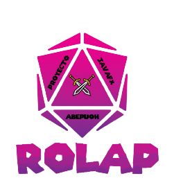

 

  

  <h3 align="center">RolApp</h3>

  

    JavaFX RolApp Project
  

<!-- TABLE OF CONTENTS -->

  
<h2 style="display: inline-block">PROYECT INDEX</h2>

  <ol>
    <li><a href="#About-the-project"> ABOUT THE PROJECT</a></li></li>
    <li><a href="#built-with">TECHNOLOGIES USED</a></li></li>
    <li><a href="#Status"> PROJECT STATUS  </a></li></li>
    <li><a href="#Contributing">Contributions</a></li></li>
    <li><a href="#bugs-and-feature-requests">Errors and bugs</a></li></li>
    <li><a href="#Contact">Contact details</a></li></li>
    <li><a href="#copyright-and-licensing">Copyright and licensing</a></li></li>
  </ol>

<!-- ABOUT THE PROJECT -->
## ABOUT THE PROJECT

This project comes after years of role-playing. One of the shortcomings of this minority sector is the <b>lack of tools</b>,
especially <b>focused more on the Role Master</b> (the individual in charge of making the whole game work perfectly). This task is certainly complicated if you want to be carried out in a serious and professional way as it demands a lot of skills, not only when it comes to developing the story, but also to 
to manage a lot of data which are key for the development of the story and the players themselves.

<!-- Technologies used -->
### BUILD WITH

In this section I show you the tools I have used to develop the project, both IDEs and languages and programs.
* [JavaFx](https://www.java.com/es/)
* [Scene Builder](https://gluonhq.com/products/scene-builder/)
* [Eclipse](https://www.eclipse.org/downloads/)

<!-- STATUS -->
#### PROJECT STATUS  

<!-- CONTRIBUTING -->
##### CONTRIBUTIONS

Contributions are what make the open source community such an amazing place to learn, inspire and create. Any contribution you make is <b>MOSTLY APPRECIATED</b>.

1. Create your own Branch (`git checkout -b feature/AmazingFeature`)
2. "Commit" your changes (`git commit -m 'Add some AmazingFeature'`)
3. Push to the Branch (`git push origin feature/AmazingFeature`)
4. Send a Pull request

<!-- CONTACT -->
###### CONTACT

Miguel Ángel García Mérida - Dammiguelangel@gmail.com

Project Link: [https://github.com/Abepuoh/RolApp](https://github.com/Abepuoh/RolApp)

<!-- LICENSE -->
###### COPYRIGHT AND LICENSE

Code and documentation copyright 2011-2018 the authors. Code released under the [MIT License](https://reponame/blob/master/LICENSE).

Enjoy :metal::metal:
